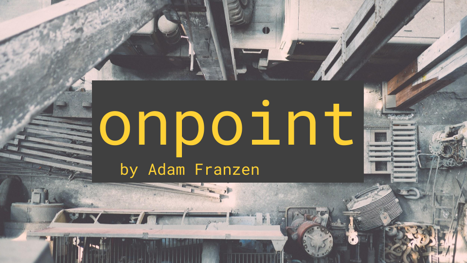
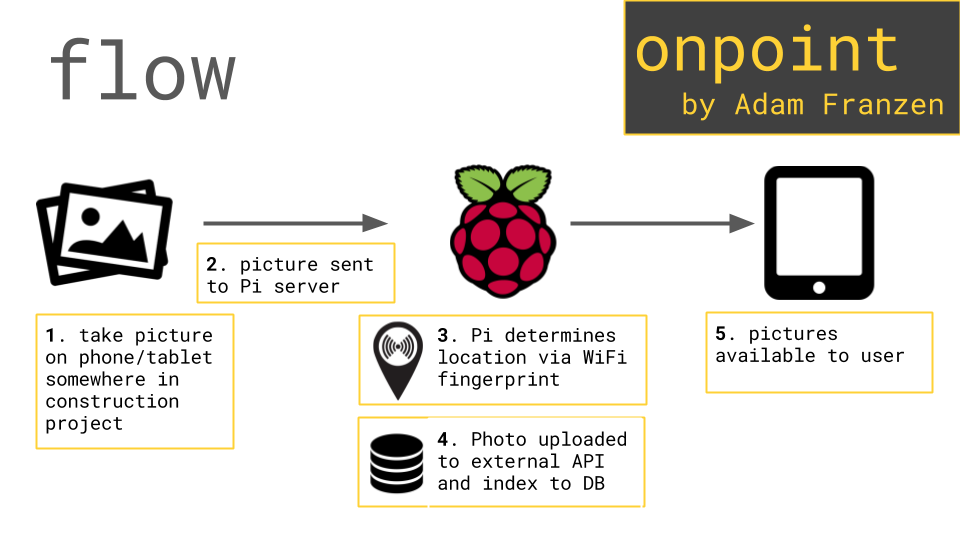

# 🚧 Welcome to the *onpoint* Github Repository! 🚧

[Visit the Deployed Website](adamfranzen.com/onpoint)

## What is *onpoint*?
A full stack platform for construction companies, built to increase transparency and accuracy on large projects by using WiFi fingerprinting. For my capstone use-case, the user takes a photo on their phone or tablet, and *onpoint* does the rest, automatically attaching the room the picture was taken in to the picture’s metadata using machine learning. This gives each picture more significance, allowing the project team to sort pictures by area, time and other attributes for as-built documentation, progress pictures, or in the event of an insurance or financial claim. 

### How does it work?

### Languages and Frameworks Used
- [Raspberry Pi](https://www.raspberrypi.org/)
- [AngularJS](https://angularjs.org/)
- [Express](http://expressjs.com/)
- [PostgreSQL](PostgreSQL)
- [Knex.js](http://knexjs.org/)
- [Axios](https://github.com/mzabriskie/axios)
- [Request-Promise](https://github.com/request/request-promise)
- [HTML5](https://developer.mozilla.org/en-US/docs/Web/HTML)
- [CSS3](https://developer.mozilla.org/en-US/docs/Web/CSS)
- [Bootstrap](http://getbootstrap.com/)

_________
#### To start the server locally - *client-side*

1. git clone or fork this repo
2. run `npm install` in the terminal.
3. run `gulp` in the Terminal/Command Line
4. copy and paste `http://localhost:8888` to your browser

#### To start the server locally - *server-side*

1. git clone or fork this repo
2. run `npm install` in the terminal.
3. run `gulp` in the Terminal/Command Line
4. copy and paste `http://localhost:3000` to your browser